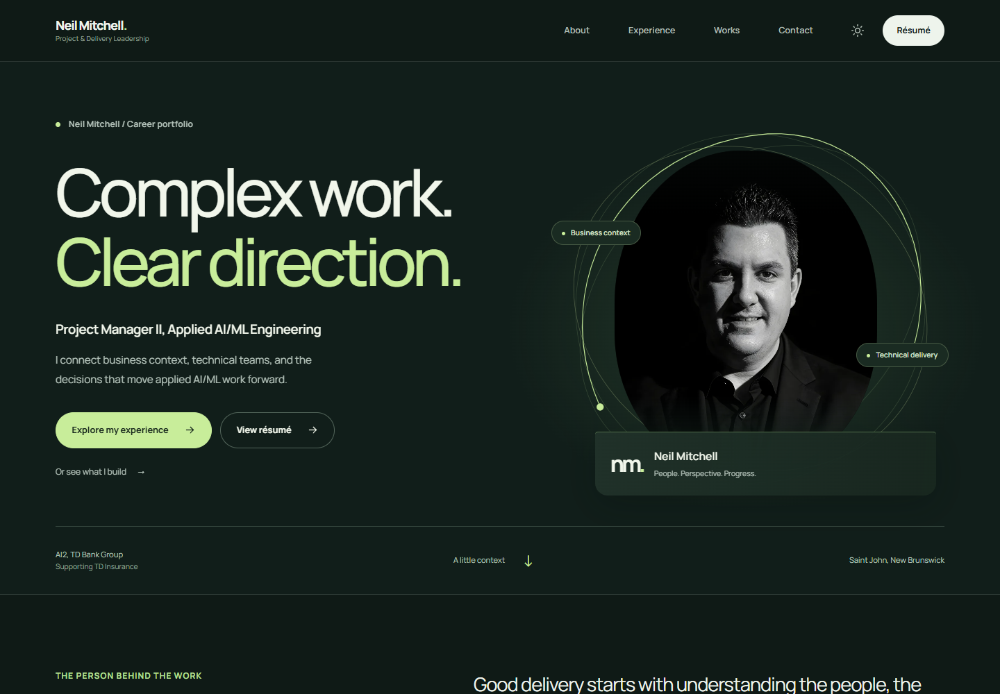
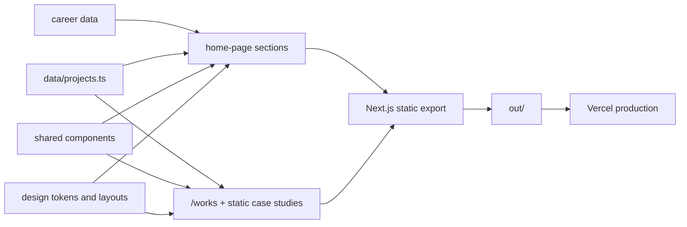

<!-- Author: Neil Mitchell | Last modified by: Neil Mitchell -->

<div align="center">
  <h1>Neil Mitchell - Career Portfolio</h1>
  <p><strong>Complex work. Clear direction.</strong></p>
  <p>
    Applied AI/ML project delivery, grounded in seven years of TD Insurance experience.
  </p>
  <p>
    <a href="https://neilmitchell.ca"><strong>View the live portfolio</strong></a>
    ·
    <a href="https://neilmitchell.ca/resume.pdf">View the résumé</a>
    ·
    <a href="https://www.linkedin.com/in/neil-mitchell-a6038b171">LinkedIn</a>
  </p>
  <p>
    <a href="https://github.com/CRSD-Lau/Personal-Site/actions/workflows/ci.yml">
      
    </a>
    <a href="https://github.com/CRSD-Lau/Personal-Site/releases">
      
    </a>
    <a href="https://neilmitchell.ca">
      
    </a>
    
    
  </p>
</div>

[](https://neilmitchell.ca)

## About

This repository contains Neil Mitchell's personal career portfolio. It presents his current
Project Manager II role in Applied AI/ML Engineering, his TD career path, delivery approach,
technical capabilities, selected impact measures, and current résumé.

The portfolio is personal and unofficial. It is not a TD Bank Group or TD Insurance website.

## What the site includes

| Area      | Purpose                                                                           |
| --------- | --------------------------------------------------------------------------------- |
| Hero      | Photographic introduction, current role, experience and résumé access             |
| Career    | Featured current role and four native disclosures retaining the complete career   |
| Approach  | Six stages from business objective through learning and improvement               |
| Expertise | Delivery strengths, platform experience, and hands-on technical practice          |
| Impact    | Career measures with count-up animation and supporting context                    |
| Works     | Independent technical case studies with clear evidence and attribution boundaries |
| Contact   | Email, copy, résumé, LinkedIn, and GitHub icons with a personal-site disclaimer   |

## Technology

- Next.js 16 App Router with static export
- React 19 with the TypeScript 7 compiler and TypeScript 6 compatibility API
- Purpose-built CSS for normalization, design tokens, and responsive layouts
- Native React and browser APIs for theme preference, navigation, progress, and metric animation
- Vercel for production hosting

No UI, icon, or animation library is required.

The locally hosted Manrope variable font, photographic hero, and responsive presentation
are documented in [DESIGN.md](./DESIGN.md). The audience and content principles are in
[PRODUCT.md](./PRODUCT.md).

TypeScript 7 supplies the native compiler invoked by `npm run typecheck`. The standard TypeScript 6
package remains installed for the compiler API required by Next.js and `typescript-eslint` during
the TypeScript 7.0 transition.

## Architecture



Content is kept separate from presentation so career updates can be made in `data/` without
rewriting component markup. See [Architecture](./docs/architecture.md) and
[Content Guide](./docs/content-guide.md) for details.

## Local development

Requirements:

- Node.js 24.x
- npm 11 or newer

```bash
git clone https://github.com/CRSD-Lau/Personal-Site.git
cd Personal-Site
npm ci
npm run dev
```

Open `http://localhost:3000`.

### Commands

| Command                     | Purpose                                                                     |
| --------------------------- | --------------------------------------------------------------------------- |
| `npm run dev`               | Start the Next.js development server                                        |
| `npm run build`             | Create the static export in `out/`                                          |
| `npm run preview`           | Serve the exported site at `http://localhost:4174`                          |
| `npm run previews:build`    | Regenerate brand cards and README screenshots from a running local export   |
| `npm run images:build`      | Regenerate responsive display images while preserving social artwork        |
| `npm run test:browser`      | Check rendered accessibility and gradient contrast against a running export |
| `npm run test:interactions` | Check responsive layouts, navigation, recovery, and installed-app behavior  |
| `npm run format`            | Format source, documentation, and repository files                          |
| `npm run lint`              | Run ESLint with warnings treated as failures                                |
| `npm run typecheck`         | Run the TypeScript compiler without emitting files                          |
| `npm test`                  | Validate career facts, project evidence, links, licences, and assets        |
| `npm run validate`          | Run source and build checks; browser checks run separately in CI            |

The [launch checklist](./docs/launch-checklist.md) records the current privacy, performance,
accessibility, and optional-feature decisions, with instructions for repeating the browser checks.

## Content and assets

| Path                                            | Responsibility                                                |
| ----------------------------------------------- | ------------------------------------------------------------- |
| `data/profile.ts`                               | Identity, current role, hero copy, links, and contact content |
| `data/experience.ts`                            | Career chronology, role summaries, and responsibilities       |
| `data/approach.ts`                              | Delivery stages and working principles                        |
| `data/skills.ts`                                | Capability groups and platform knowledge                      |
| `data/impact.ts`                                | Impact metrics and supporting stories                         |
| `data/projects.ts`                              | Independent project records, evidence snapshots, and links    |
| `app/icon.png`                                  | Round headshot favicon                                        |
| `public/social/portfolio-v3.png`                | Versioned 1200 x 630 homepage social preview                  |
| `public/social/works-v3.png`                    | Versioned 1200 x 630 Works collection social preview          |
| `public/opengraph-image.png`                    | Compatibility copy of the current homepage preview            |
| `public/works/deep-live-cam/social-preview.png` | Reviewed Deep Live Cam Studio repository artwork              |
| `docs/assets/portfolio-preview.png`             | Current homepage screenshot shown in this README              |
| `docs/assets/readme-screenshot.jpg`             | Compatibility copy of the current homepage screenshot         |
| `docs/assets/repository-social-preview.png`     | 1280 x 640 artwork for GitHub's repository social preview     |
| `app/manifest.ts`                               | Install metadata and app icon declaration                     |
| `app/robots.ts`                                 | Search crawler policy and sitemap discovery                   |
| `app/sitemap.ts`                                | Canonical production URL for search indexing                  |
| `public/profile.webp`                           | Hero portrait                                                 |
| `public/logo.png`                               | Official TD employer marker used beside TD roles              |
| `public/resume.pdf`                             | Public résumé downloaded from the site                        |

Follow the evidence and wording rules in the [Content Guide](./docs/content-guide.md) before
changing career claims, impact figures, or independent-project records. The project preview's
separate source terms and provenance are recorded in [LICENSE.md](./LICENSE.md).

## Brand and sharing previews

The website, sharing cards, and repository use the same photographic portrait, locally hosted
Manrope, dark forest canvas, pale lime accents, and “Complex work. Clear direction.” positioning.
The Works collection has its own card; individual case studies retain their reviewed project artwork.

Website sharing metadata lives in `data/profile.ts` and the route metadata. The GitHub repository's
social preview is a separate repository setting: committing its image does not upload it to GitHub.
The [brand and preview audit](./docs/brand-preview-audit.md) records the findings, asset inventory,
and publication status. Follow [Deployment](./docs/deployment.md#sharing-previews-and-repository-branding)
when changing cards or refreshing a cached link preview.

## Résumé workflow

The editable résumé source is
[`documents/Neil-Mitchell-Resume.docx`](./documents/Neil-Mitchell-Resume.docx). The published
copy is [`public/resume.pdf`](./public/resume.pdf).

The build helper creates the DOCX and finalizes PDF metadata:

```bash
python scripts/build-resume.py
python scripts/build-resume.py --pdf-input path/to/converted.pdf
```

Microsoft Word or another compatible renderer is used between those commands to convert DOCX to
PDF. The final PDF and DOCX must list `Neil Mitchell` as author and modifier.

## Quality and release process

Every push and pull request to `main` runs the same `npm run validate` gate used locally.
Dependabot checks npm and GitHub Actions dependencies on a weekly schedule.

Release history is recorded in [CHANGELOG.md](./CHANGELOG.md). The full publishing and rollback
workflow is documented in [Deployment](./docs/deployment.md) and
[Release Process](./docs/release-process.md).

## Contributing and security

- Read [CONTRIBUTING.md](./CONTRIBUTING.md) before proposing a change.
- Report vulnerabilities through [GitHub private vulnerability reporting](./SECURITY.md).
- Use the [project wiki](https://github.com/CRSD-Lau/Personal-Site/wiki) for operating guidance.

## Licence and employer notice

Copyright © 2026 Neil Mitchell. All rights reserved. See [LICENSE.md](./LICENSE.md).

TD, TD Bank Group, TD Insurance, and related marks belong to their respective owners. Their names
and logo appear only to describe employment history. This repository and website are personal and
unofficial.
