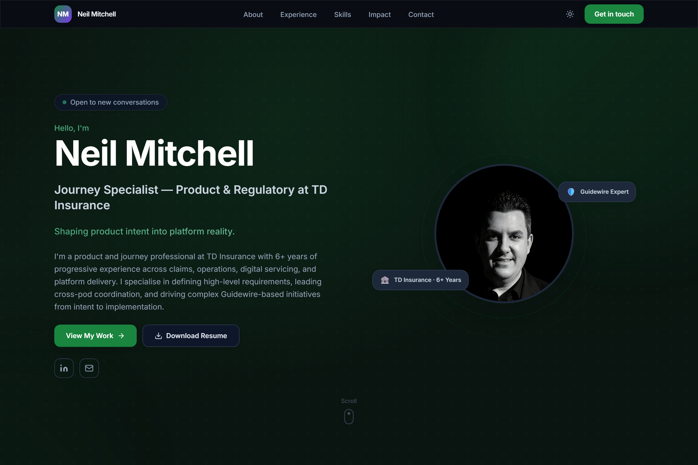

# Neil Mitchell Personal Website

Personal website for Neil Mitchell, Journey Specialist, Product and Regulatory at TD Insurance. The site presents Neil's product delivery experience, Guidewire work, skills, impact highlights, resume, and contact links.

Live site: https://neil-mitchell.vercel.app

## Screenshot



## Tech Stack

- Next.js 15 with App Router and static export
- TypeScript
- Tailwind CSS
- Vercel deployment

## Local Development

```bash
npm install
npm run dev
```

Local dev runs at `http://localhost:3000`.

Build for production:

```bash
npm run build
```

## Deployment

```bash
npm run build
vercel --prod
vercel alias set <new-deployment-url>.vercel.app neil-mitchell.vercel.app
```

First-time Vercel setup:

```bash
npm install -g vercel
vercel login
vercel --prod
```

If the site requires login to view, turn off Deployment Protection in the Vercel project settings.

## Deploy Workflow

```bash
npm run dev
npm run build
git add .
git commit -m "describe your change"
git push origin clean-branch
vercel --prod
vercel alias set <new-url>.vercel.app neil-mitchell.vercel.app
```

## Project Structure

```text
app/
  layout.tsx        Root layout, metadata, fonts
  page.tsx          Single-page entry point
  globals.css       Tailwind base and custom utilities

components/
  Navigation.tsx    Sticky nav, mobile menu, active section highlight
  DarkModeToggle.tsx
  ScrollProgress.tsx
  SectionReveal.tsx
  AnimatedCounter.tsx

sections/
  Hero.tsx          Name, headline, photo, CTAs
  About.tsx         Professional summary and working philosophy
  Experience.tsx    Career timeline
  Skills.tsx        Skill groups and capability tags
  Impact.tsx        Key metrics and initiatives
  WorkingStyle.tsx  Values and testimonial
  Contact.tsx       Contact links and message form
  Footer.tsx

public/
  profile.jpg       Headshot
  logo.png          TD shield logo used in Experience
  resume.pdf        Downloadable resume
```

## Content Updates

| What | Where |
|---|---|
| Name, headline, bio | `sections/Hero.tsx`, `HERO_CONTENT` |
| About text | `sections/About.tsx`, `ABOUT_CONTENT` |
| Work experience | `sections/Experience.tsx`, `EXPERIENCE_DATA.roles` |
| Skills | `sections/Skills.tsx`, `SKILLS_DATA` |
| Impact metrics | `sections/Impact.tsx`, `IMPACT_DATA` |
| Values | `sections/WorkingStyle.tsx`, `WORKING_STYLE` |
| Contact details | `sections/Contact.tsx`, `CONTACT_DATA` |
| Brand colours | `tailwind.config.ts`, `colors.brand` |
| SEO metadata | `app/layout.tsx`, `metadata` |
| Headshot | Replace `public/profile.jpg` |
| Resume PDF | Replace `public/resume.pdf` |

## Resume Download

Place the PDF at `public/resume.pdf`. The download button in the Hero and Contact sections links to `/resume.pdf`.
