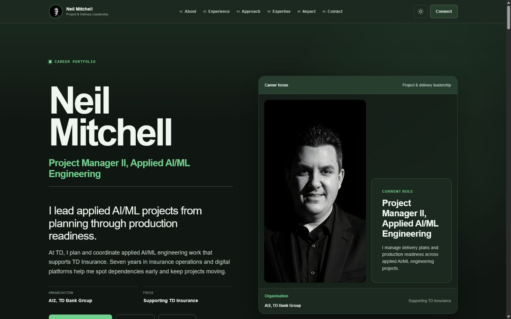
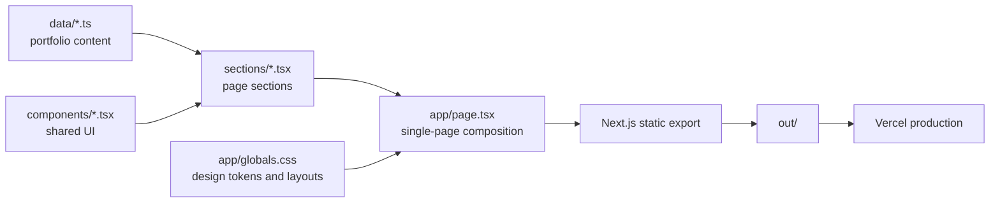

<div align="center">
  <h1>Neil Mitchell - Career Portfolio</h1>
  <p>
    Project and delivery leadership for applied AI/ML engineering, grounded in seven years of
    TD Insurance experience.
  </p>
  <p>
    <a href="https://neil-mitchell.vercel.app"><strong>View the live portfolio</strong></a>
    ·
    <a href="https://neil-mitchell.vercel.app/resume.pdf">View the résumé</a>
    ·
    <a href="https://www.linkedin.com/in/neil-mitchell-a6038b171">LinkedIn</a>
  </p>
  <p>
    <a href="https://github.com/CRSD-Lau/Personal-Site/actions/workflows/ci.yml">
      
    </a>
    <a href="https://github.com/CRSD-Lau/Personal-Site/releases">
      
    </a>
    <a href="https://neil-mitchell.vercel.app">
      
    </a>
    
    
  </p>
</div>



## About

This repository contains Neil Mitchell's personal career portfolio. It presents his current
Project Manager II role in Applied AI/ML Engineering, his TD career path, delivery approach,
technical capabilities, selected impact measures, and current résumé.

The portfolio is personal and unofficial. It is not a TD Bank Group or TD Insurance website.

## What the site includes

| Area      | Purpose                                                                               |
| --------- | ------------------------------------------------------------------------------------- |
| Hero      | Current role, focus, headshot, résumé, and LinkedIn access                            |
| Career    | Five TD roles across claims, vendor operations, digital servicing, product, and AI/ML |
| Approach  | Six stages from business objective through learning and improvement                   |
| Expertise | Delivery strengths, platform experience, and technical literacy                       |
| Impact    | Career measures with count-up animation and supporting context                        |
| Contact   | Direct contact options and a clear personal-site disclaimer                           |

## Technology

- Next.js 16 App Router with static export
- React 19 and strict TypeScript
- Tailwind CSS 3 for the base layer
- Semantic CSS for the design system and responsive layouts
- Native React and browser APIs for theme preference, navigation, progress, and metric animation
- Vercel for production hosting

No UI, icon, or animation library is required.

## Architecture



Content is kept separate from presentation so career updates can be made in `data/` without
rewriting component markup. See [Architecture](./docs/architecture.md) and
[Content Guide](./docs/content-guide.md) for details.

## Local development

Requirements:

- Node.js 20.19 or newer
- npm 10 or newer

```bash
git clone https://github.com/CRSD-Lau/Personal-Site.git
cd Personal-Site
npm ci
npm run dev
```

Open `http://localhost:3000`.

### Commands

| Command             | Purpose                                                       |
| ------------------- | ------------------------------------------------------------- |
| `npm run dev`       | Start the Next.js development server                          |
| `npm run build`     | Create the static export in `out/`                            |
| `npm run preview`   | Serve the exported site at `http://localhost:4174`            |
| `npm run format`    | Format source, documentation, and repository files            |
| `npm run lint`      | Run ESLint with warnings treated as failures                  |
| `npm run typecheck` | Run the TypeScript compiler without emitting files            |
| `npm test`          | Validate dates, titles, metrics, résumé links, and stale copy |
| `npm run validate`  | Run every release gate, including a production build          |

## Content and assets

| Path                  | Responsibility                                                |
| --------------------- | ------------------------------------------------------------- |
| `data/profile.ts`     | Identity, current role, hero copy, links, and contact content |
| `data/experience.ts`  | Career chronology, role summaries, and responsibilities       |
| `data/approach.ts`    | Delivery stages and working principles                        |
| `data/skills.ts`      | Capability groups and platform knowledge                      |
| `data/impact.ts`      | Impact metrics and supporting stories                         |
| `app/icon.png`        | Round headshot favicon                                        |
| `public/profile.webp` | Header and hero headshot                                      |
| `public/logo.png`     | Official TD employer marker used beside TD roles              |
| `public/resume.pdf`   | Public résumé downloaded from the site                        |

Follow the evidence and wording rules in the [Content Guide](./docs/content-guide.md) before
changing career claims or impact figures.

## Résumé workflow

The editable résumé source is
[`documents/Neil-Mitchell-Resume.docx`](./documents/Neil-Mitchell-Resume.docx). The published
copy is [`public/resume.pdf`](./public/resume.pdf).

The build helper creates the DOCX and finalizes PDF metadata:

```bash
python scripts/build-resume.py
python scripts/build-resume.py --pdf-input path/to/converted.pdf
```

Microsoft Word or another compatible renderer is used between those commands to convert DOCX to
PDF. The final PDF and DOCX must list `Neil Mitchell` as author and modifier.

## Quality and release process

Every push and pull request to `main` runs the same `npm run validate` gate used locally.
Dependabot checks npm and GitHub Actions dependencies on a weekly schedule.

Release history is recorded in [CHANGELOG.md](./CHANGELOG.md). The full publishing and rollback
workflow is documented in [Deployment](./docs/deployment.md) and
[Release Process](./docs/release-process.md).

## Contributing and security

- Read [CONTRIBUTING.md](./CONTRIBUTING.md) before proposing a change.
- Report vulnerabilities through [GitHub private vulnerability reporting](./SECURITY.md).
- Use the [project wiki](https://github.com/CRSD-Lau/Personal-Site/wiki) for operating guidance.

## Licence and employer notice

Copyright © 2026 Neil Mitchell. All rights reserved. See [LICENSE.md](./LICENSE.md).

TD, TD Bank Group, TD Insurance, and related marks belong to their respective owners. Their names
and logo appear only to describe employment history. This repository and website are personal and
unofficial.
