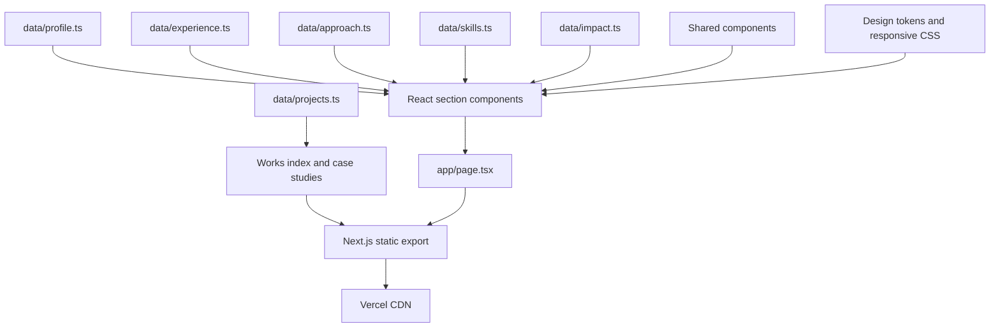

# Architecture

## Purpose

The portfolio is a statically exported Next.js application. It keeps career content separate from
presentation, requires no application server, and deploys as versioned static files on Vercel.

## Runtime model

The production artifact is the `out/` directory created by `npm run build`.

## Main layers

### Application shell

- `app/layout.tsx` owns document metadata, canonical URL, theme bootstrap, and viewport behaviour.
- `app/page.tsx` composes the single-page portfolio, including the Works preview section, and emits Person structured data.
- `app/works/page.tsx` renders the independent-project index; `app/works/[slug]/page.tsx` statically
  renders each declared case study with page-specific metadata and a CreativeWork schema whose
  software subject carries repository and licence data.
- `app/globals.css` owns design tokens, responsive layouts, motion, and accessibility states.
- `app/icon.png` provides the round headshot favicon.
- `public/opengraph-image.png` provides the 1200 x 630 root-page social preview.
- `app/manifest.ts`, `app/robots.ts`, and `app/sitemap.ts` emit static discovery metadata.

### Content model

The files in `data/` are the source of truth for visible career content:

- `profile.ts`: identity, current role, links, and contact copy
- `experience.ts`: role order, dates, organisations, and responsibilities
- `approach.ts`: delivery stages and working principles
- `skills.ts`: capability groups and technology literacy
- `impact.ts`: measured outcomes and supporting stories
- `projects.ts`: independent project content, fixed evidence snapshots, preview provenance, external links, and attribution

The current role is derived from `experience.ts` instead of repeated manually.

### Presentation

Files in `sections/` own page-level compositions. Files in `components/` own reusable or interactive
elements such as navigation, theme preference, impact counters, icons, project evidence visuals, and the
current-role card.

### Build toolchain

- Node.js 24 is used for local development, GitHub Actions, and Vercel production builds.
- TypeScript 7 supplies the native `tsc` command.
- The official TypeScript 6 compatibility package remains available under the `typescript` package
  name for Next.js and `typescript-eslint` until TypeScript 7 exposes its replacement compiler API.
- The design system is purpose-built CSS. Tailwind CSS and Autoprefixer are not part of the runtime
  or build pipeline.
- Next.js's transitive PostCSS dependency is pinned to a patched release through npm overrides.

### Client behaviour

The exported page works without client-side data fetching. Small client components provide:

- Theme persistence
- Mobile navigation
- Scroll progress
- Email copying
- Viewport-triggered impact counters

The Works pages use no client-side data fetching. Their project routes are produced from
`generateStaticParams`, and the same typed project list supplies the index and sitemap. On the home page,
Works follows Impact as a normal section anchor; from project routes, the header navigation returns to
that home-page section while the case-study back link and footer open the full Works index.

Core content remains present in static HTML.

## Quality controls

`npm run validate` runs five gates:

1. Prettier formatting
2. ESLint with zero warnings
3. TypeScript compilation
4. Domain-specific content validation
5. Production static build

The content validator protects high-risk facts such as current role dates, organisation labels,
career tenure, impact figures, résumé availability, project evidence labels, exact external targets,
preview provenance, licensing boundaries, and prohibited employer claims in independent work.

## Accessibility

- Semantic landmarks and heading order
- Skip link and visible keyboard focus
- Static text equivalents for animated metrics
- Reduced-motion support
- Meaningful image alternative text
- Touch targets sized for phone use
- Colour-independent state and labels

## Deployment boundary

Vercel serves the static export. There is no database, API, authentication layer, or server-side
contact form. Contact actions open the user's email client or LinkedIn.

This narrow runtime reduces operational and security risk.
