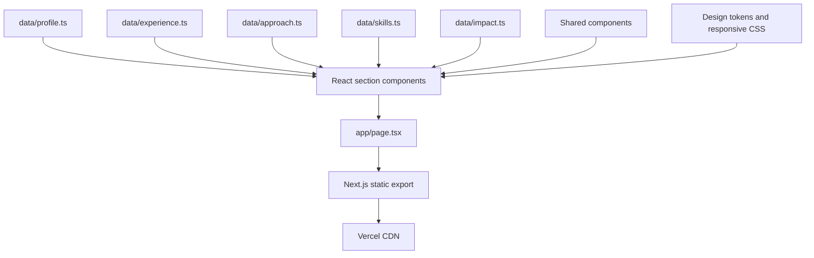

# Architecture

## Purpose

The portfolio is a statically exported Next.js application. It keeps career content separate from
presentation, requires no application server, and deploys as versioned static files on Vercel.

## Runtime model

The production artifact is the `out/` directory created by `npm run build`.

## Main layers

### Application shell

- `app/layout.tsx` owns document metadata, canonical URL, theme bootstrap, and viewport behaviour.
- `app/page.tsx` composes the single-page portfolio and emits Person structured data.
- `app/globals.css` owns design tokens, responsive layouts, motion, and accessibility states.

### Content model

The files in `data/` are the source of truth for visible career content:

- `profile.ts`: identity, current role, links, and contact copy
- `experience.ts`: role order, dates, organisations, and responsibilities
- `approach.ts`: delivery stages and working principles
- `skills.ts`: capability groups and technology literacy
- `impact.ts`: measured outcomes and supporting stories

The current role is derived from `experience.ts` instead of repeated manually.

### Presentation

Files in `sections/` own page-level compositions. Files in `components/` own reusable or interactive
elements such as navigation, theme preference, impact counters, icons, and the current-role card.

### Client behaviour

The exported page works without client-side data fetching. Small client components provide:

- Theme persistence
- Mobile navigation
- Scroll progress
- Email copying
- Viewport-triggered impact counters

Core content remains present in static HTML.

## Quality controls

`npm run validate` runs five gates:

1. Prettier formatting
2. ESLint with zero warnings
3. TypeScript compilation
4. Domain-specific content validation
5. Production static build

The content validator protects high-risk facts such as current role dates, organisation labels,
career tenure, impact figures, and résumé availability.

## Accessibility

- Semantic landmarks and heading order
- Skip link and visible keyboard focus
- Static text equivalents for animated metrics
- Reduced-motion support
- Meaningful image alternative text
- Touch targets sized for phone use
- Colour-independent state and labels

## Deployment boundary

Vercel serves the static export. There is no database, API, authentication layer, or server-side
contact form. Contact actions open the user's email client or LinkedIn.

This narrow runtime reduces operational and security risk.
